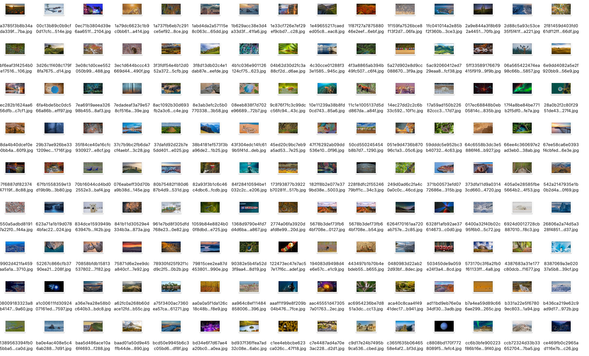

# cim
Alfred workflow: change mac desktop background image

## Installation
1. Download latest version from [releases](https://github.com/haoguanguan/cim/releases)
2. Double click and fill env named with `image_base_path`

## Manual
Input `cim $id`, id range is [0, 1, 2, 3, 4, 5, 6, 7], means [today, yesterday, ...]

You Can visit [here](https://www.bing.com/) for detail.

## Features
1. Crawling pic links from bing
2. Saveing pic into filepath config `image_base_path`
3. Setting current pic as desktop background image

## Acknowledgement
Thanks bing.
